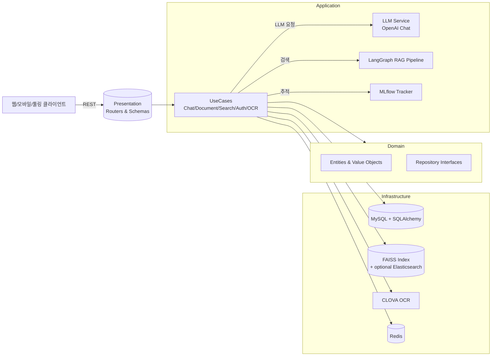
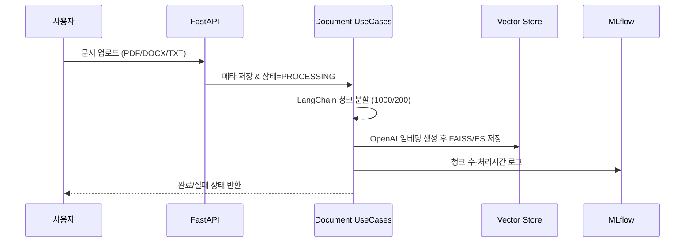
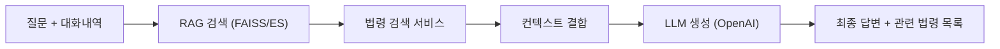

# DDD RAG Chatbot Server

    

도메인 주도 설계(DDD)로 구성된 LangGraph 기반 RAG 서버입니다. 사내 문서, 외부 법령, OCR 이미지까지 한 번에 검색·요약·답변하며, MLflow로 전 과정을 추적합니다.

## 한눈에 보기
- Layered DDD: `presentation → application → domain → infrastructure`로 관심사 분리
- LangGraph RAG: 벡터 검색(FAISS/Elasticsearch) + 법령 검색을 결합해 답변 생성
- 데이터 파이프라인: PDF/DOCX/TXT 업로드 → LangChain 청크 분할 → OpenAI 임베딩 저장
- 운영 도구: MLflow, Redis 캐시, Kibana/Elasticsearch 스택, Docker Compose 일체형
- OCR 지원: CLOVA OCR로 텍스트 추출 후 OpenAI(`gpt-4o-mini`)로 리포트/QA 생성

## 아키텍처 지도


### 데이터 플로우




## 폴더 맵
```
.
├── main.py                     # FastAPI 부트스트랩 & 라우팅 등록
├── app/
│   ├── chat/                   # LangGraph RAG, 세션/메시지 관리
│   ├── documents/              # 업로드, 청크 분할, 벡터 적재
│   ├── search/                 # FAISS + (옵션) Elasticsearch 검색
│   ├── auth/                   # Google OAuth, 사용자 관리
│   ├── ocr/                    # CLOVA OCR + AI 분석
│   ├── db/                     # SQLAlchemy 모델/세션
│   ├── core/config.py          # 환경설정 (.env)
│   └── shared/                 # MLflow, 캐시, DI 헬퍼
├── docker/docker-compose.yaml  # MySQL + Elasticsearch + Redis + Kibana + App
├── data/                       # FAISS/업로드/MLflow 기본 경로
└── docs/AUTH_GUIDE.md          # OAuth 연동 가이드
```

## 빠른 시작
```bash
python -m venv .venv
source .venv/bin/activate
pip install --upgrade pip
pip install -r requirements.txt

docker compose -f docker/docker-compose.yaml up -d   # MySQL/ES/Redis/Kibana
uvicorn main:app --reload                             # http://localhost:8000
```

MLflow UI를 보고 싶다면 별도 터미널에서 `mlflow ui --backend-store-uri data/mlruns` 실행.

## 필수/주요 환경 변수
| Key | 기본값 | 설명 |
| --- | --- | --- |
| `OPENAI_API_KEY` | (필수) | Chat/RAG/OCR 분석에 사용 |
| `ANTHROPIC_API_KEY` | "" | 필요 시 Claude 임베딩 대체용 |
| `CLAUDE_EMBEDDING_MODEL` | `text-embedding-001` | Claude 사용 시 모델명 |
| `FAISS_DB_PATH` | `./data/faiss` | FAISS 인덱스/메타 저장 경로 |
| `UPLOAD_DIR` | `./data/uploads` | 원본 업로드 파일 저장 경로 |
| `MLFLOW_TRACKING_URI` | `./data/mlruns` | MLflow 스토리지 |
| `DB_HOST` | `127.0.0.1` (도커는 `mysql`) | MySQL 호스트 |
| `DB_PORT` | `3306` | MySQL 포트 |
| `DB_USERNAME` / `DB_PASSWORD` | `appuser` / `apppw` | MySQL 계정 |
| `ELASTICSEARCH_HOST` / `PORT` | `127.0.0.1` / `9200` | ES 검색 사용 시 |
| `CLOVA_OCR_API_URL` / `CLOVA_OCR_SECRET_KEY` | "" | CLOVA OCR 호출 정보 |
| `GOOGLE_CLIENT_ID` / `GOOGLE_CLIENT_SECRET` | "" | OAuth 로그인 |
| `ASSEMBLY_API_KEY` | (선택) | 의회·법률정보 포털 |

## API 하이라이트
- `POST /documents/upload` : PDF/DOCX/TXT 업로드 → 청크 → 벡터 적재
- `GET /documents` / `GET /documents/{id}` / `DELETE /documents/{id}`
- `POST /chat` : LangGraph RAG 답변 + 관련 법령 + 세션 히스토리
- `GET /chat/sessions` / `GET /chat/sessions/{id}/history` / `DELETE ...`
- `POST /ocr/extract` : 이미지/PDF → 텍스트 추출 (CLOVA)
- `POST /ocr/analyze` : 추출 텍스트를 `gpt-4o-mini`로 요약·QA·주의사항 생성
- `POST /auth/google` : 액세스 토큰 기반 로그인, `/auth/users` CRUD
- 참고: `test_main.http`에 VS Code REST Client용 샘플 요청이 포함되어 있습니다.

## 운영 & 관측
- MLflow: 업로드/채팅의 청크 수, 처리 시간, 검색/생성 지연을 로그
- Elasticsearch + Kibana: (옵션) 텍스트 검색/대시보드
- Redis: 토큰/세션 캐시 및 잠재적 큐잉 용도
- 데이터 경로: `data/uploads`(원본), `data/faiss`(인덱스+메타), `data/mlruns`(실험)

## 개발 팁
- DDD 레이어 유지: `presentation`에서는 DTO 검증/라우팅만, 비즈니스 규칙은 `application/domain`에 위치
- 새 통합(예: 다른 OCR/LLM) 시 `infrastructure` 어댑터만 교체하면 상위 레이어 영향 최소화
- OAuth 세부 설정은 `docs/AUTH_GUIDE.md` 참고

즐겁게 해킹하세요! 🚀
